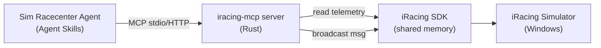

# iracing-mcp

**A Broadcast & Replay Controller for Agentic Streaming.**

`iracing-mcp` is a [Model Context Protocol (MCP)](https://modelcontextprotocol.io) server that
exposes the iRacing simulator's telemetry and remote-control surface as a set of safe, deterministic
tools. It is designed to be driven by an LLM agent (a "sim racecenter" / broadcast director agent)
so the agent can interrogate a live session and direct the replay and camera system using natural
language, e.g.:

> "Show the replay of the incident at 14:32 involving Max."

The server translates that intent—via the agent and a small set of well-typed MCP tools—into
concrete iRacing SDK broadcast messages, then **verifies the effect** by reading the resulting
telemetry back, so the agent always knows whether an action actually worked.

## Why this exists

The iRacing SDK control channel is **fire-and-forget**: replay and camera commands are sent as
Windows broadcast messages with no return value (see
[`irsdk_broadcastMsg`](iracing/irsdk-1-20/irsdk_1_20/irsdk_utils.cpp#L365), which calls
`SendNotifyMessage(HWND_BROADCAST, ...)`). An agent therefore cannot trust that a command worked
just because it was sent. `iracing-mcp` closes that loop by pairing every command with a
**telemetry-based verification step**.

## What it provides

- **Session interrogation tools** — roster, weekend info, camera groups, standings, and a fast
  session overview, so the agent can ground itself in the current state.
- **Replay control tools** — play/pause/speed, seek by frame, seek by session time, jump to
  incidents/laps, and a high-level "show this window" helper.
- **Camera control tools** — focus a car, select a camera group/camera, and set camera state.
- **Verification responses** — every mutating tool returns the observed telemetry after the action
  with a `verified` flag, so the agent can retry or report failure intelligently.

## Architecture at a glance

The server runs on the **same Windows machine** as iRacing because the SDK uses a local shared
memory map and `RegisterWindowMessage` broadcast (see
[`irsdk_defines.h`](iracing/irsdk-1-20/irsdk_1_20/irsdk_defines.h#L88) and
[`irsdk_utils.cpp`](iracing/irsdk-1-20/irsdk_1_20/irsdk_utils.cpp#L347)).

## Documentation

| Document | Purpose |
| --- | --- |
| [docs/IMPLEMENTATION_PLAN.md](docs/IMPLEMENTATION_PLAN.md) | Full design, milestones, SDK references, example use case |
| [docs/TOOL_REFERENCE.md](docs/TOOL_REFERENCE.md) | Every MCP tool, its schema, data structures, and discovery metadata |
| [docs/FEEDBACK_VERIFICATION.md](docs/FEEDBACK_VERIFICATION.md) | How command verification responses work, per command |
| [docs/USER_GUIDE.md](docs/USER_GUIDE.md) | How to install, configure, connect a client, and use the agent |
| [docs/TESTING.md](docs/TESTING.md) | Integration test strategy against a live iRacing session |

## Reference material

The `iracing/` folder contains the official iRacing SDK source and the telemetry variable list used
throughout the docs:

- [iracing/telemetry_11_23_15.md](iracing/telemetry_11_23_15.md) — full live/disk telemetry variable list and YAML session string layout.
- [iracing/irsdk-1-20/](iracing/irsdk-1-20/) — the C++ SDK (`irsdk_defines.h`, `irsdk_client.h`, broadcast utilities, and the `irsdk_msgtest` example).
- [iracing/irsdk_csharp_2024_03_09/](iracing/irsdk_csharp_2024_03_09/) — the C# SDK reference.

## Status

Early development. The reference docs describe the intended tool surface; implementation milestones
are tracked in [docs/IMPLEMENTATION_PLAN.md](docs/IMPLEMENTATION_PLAN.md).

## License

The bundled `iracing/` SDK sources retain their original iRacing.com Motorsport Simulations license
(see headers in each file). Project code license: TBD.
