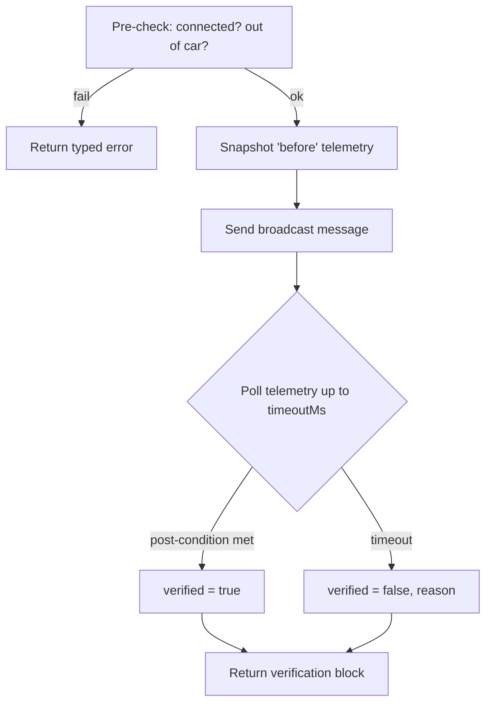

# iracing-mcp — Feedback Verification

## Why verification is required

iRacing's remote-control API is **fire-and-forget**. The broadcast helper posts a Windows message
system-wide and returns nothing:

```cpp
// irsdk_utils.cpp
static unsigned int msgId = RegisterWindowMessage(IRSDK_BROADCASTMSGNAME);
...
SendNotifyMessage(HWND_BROADCAST, msgId, MAKELONG(msg, var1), var2);
```

See [irsdk_utils.cpp](../iracing/irsdk-1-20/irsdk_1_20/irsdk_utils.cpp#L365). `SendNotifyMessage`
does not block and does not return an application acknowledgement. There is **no callback, no ack,
no error** from the sim.

Therefore the only reliable confirmation that a command worked is to **observe a change in the live
telemetry** that the command should have caused. Every mutating tool in `iracing-mcp` does this and
reports the result in a verification block.

## The verification loop



1. **Pre-check** — Connection via the SDK status flag (`irsdk_stConnected`, see
   [irsdk_defines.h](../iracing/irsdk-1-20/irsdk_1_20/irsdk_defines.h#L101)). Eligibility via
   `IsOnTrack`/`IsInGarage` because replay & camera commands only work **out of car**
   ([irsdk_defines.h](../iracing/irsdk-1-20/irsdk_1_20/irsdk_defines.h#L453)).
2. **Snapshot** — Read the specific vars that the command should change. Record the telemetry
   `tickCount` ([irsdk_defines.h](../iracing/irsdk-1-20/irsdk_1_20/irsdk_defines.h#L390)).
3. **Send** — Emit the broadcast message (the only "best effort" step).
4. **Poll** — Use the SDK's wait-for-data pattern (`waitForData` in
   [irsdk_client.h](../iracing/irsdk-1-20/irsdk_1_20/irsdk_client.h#L40)) and re-read the vars each
   tick until the post-condition holds or `timeoutMs` elapses. Telemetry updates ~60×/sec, so a
   750 ms timeout allows ~45 samples.
5. **Return** — The verification block (defined in
   [TOOL_REFERENCE.md](TOOL_REFERENCE.md#2-verification-block-mutating-tools)).

## The verification block

```jsonc
{
  "commandAccepted": true,   // the broadcast was sent
  "verified": true,          // telemetry confirmed the effect — the field to trust
  "reason": null,            // why verified=false (e.g. "frame did not change")
  "before": { "...": "..." },
  "observed": { "...": "..." },
  "elapsedMs": 120,
  "pollCount": 8
}
```

> **Agent rule of thumb:** trust `verified`, not `commandAccepted`. `commandAccepted: true` only
> means "the message left the building."

## Per-command verification matrix

| Tool | Broadcast (SDK) | Expected post-condition | Telemetry watched | Default timeout |
| --- | --- | --- | --- | --- |
| `replay_set_playback` | [`ReplaySetPlaySpeed`](../iracing/irsdk-1-20/irsdk_1_20/irsdk_defines.h#L460) | `ReplayPlaySpeed == speed`, `ReplayPlaySlowMotion == slowMotion`, `IsReplayPlaying == (speed != 0)` | `ReplayPlaySpeed`, `ReplayPlaySlowMotion`, `IsReplayPlaying` | 750 ms |
| `replay_seek_frame` | [`ReplaySetPlayPosition`](../iracing/irsdk-1-20/irsdk_1_20/irsdk_defines.h#L461) | `ReplayFrameNum` within ±tolerance of target | `ReplayFrameNum`, `ReplayFrameNumEnd` | 750 ms |
| `replay_seek_session_time` | [`ReplaySearchSessionTime`](../iracing/irsdk-1-20/irsdk_1_20/irsdk_defines.h#L467) | `ReplaySessionNum == sessionNum` and `|ReplaySessionTime·1000 − target| ≤ toleranceMs` | `ReplaySessionNum`, `ReplaySessionTime` | 1000 ms |
| `replay_search_event` | [`ReplaySearch`](../iracing/irsdk-1-20/irsdk_1_20/irsdk_defines.h#L462) | `ReplayFrameNum` changed (direction-checked for `next_*`/`prev_*`) | `ReplayFrameNum` | 750 ms |
| `camera_focus` | [`CamSwitchNum`](../iracing/irsdk-1-20/irsdk_1_20/irsdk_defines.h#L458) / [`CamSwitchPos`](../iracing/irsdk-1-20/irsdk_1_20/irsdk_defines.h#L457) | `CamCarIdx == carIdx` (+ group/camera if set) | `CamCarIdx`, `CamGroupNumber`, `CamCameraNumber` | 750 ms |
| `camera_set_state` | [`CamSetState`](../iracing/irsdk-1-20/irsdk_1_20/irsdk_defines.h#L459) | `CamCameraState` bits match request | `CamCameraState` | 750 ms |
| `replay_show_window` | composite | each sub-step verified | aggregate of the above | 2000 ms |

The telemetry variables above are defined in
[telemetry_11_23_15.md](../iracing/telemetry_11_23_15.md#L110) (replay) and
[telemetry_11_23_15.md](../iracing/telemetry_11_23_15.md#L19) (camera).

## Tolerances & timing guidance

- **Frames are 60/sec.** `ReplayFrameNum` description:
  [telemetry_11_23_15.md](../iracing/telemetry_11_23_15.md#L110). A ±4-frame tolerance (~66 ms)
  absorbs the sim settling on the nearest keyframe.
- **Session time** verification tolerance defaults to 500 ms because seeking snaps to the nearest
  available replay position.
- **Camera switches** can take a few frames to reflect in `CamCarIdx`; poll, don't sample once.
- **Speed changes** are near-instant but still poll one or two ticks to avoid reading the pre-command
  value.

## Worked example responses

### Success — `camera_focus`

```jsonc
{
  "ok": true,
  "asOfUtc": "2026-06-16T14:32:11Z",
  "sourceTick": 183455,
  "data": {
    "commandAccepted": true,
    "verified": true,
    "reason": null,
    "before": { "camCarIdx": 3, "camGroupNumber": 3, "camCameraNumber": 1 },
    "observed": { "camCarIdx": 7, "camGroupNumber": 3, "camCameraNumber": 1 },
    "elapsedMs": 96,
    "pollCount": 6
  },
  "warnings": [],
  "error": null
}
```

### Not verified — `replay_search_event`

```jsonc
{
  "ok": true,
  "asOfUtc": "2026-06-16T14:33:02Z",
  "data": {
    "commandAccepted": true,
    "verified": false,
    "reason": "ReplayFrameNum did not change within 750ms (no further incidents in this direction).",
    "before": { "frameNum": 0 },
    "observed": { "frameNum": 0 },
    "elapsedMs": 750,
    "pollCount": 45
  },
  "warnings": ["Already at the first incident; nothing earlier to jump to."],
  "error": null
}
```

### Hard error — wrong mode

```jsonc
{
  "ok": false,
  "asOfUtc": "2026-06-16T14:31:40Z",
  "data": null,
  "warnings": [],
  "error": {
    "code": "wrong_mode",
    "message": "Player is in the car; replay/camera control requires being out of the car.",
    "retryable": false
  }
}
```

## How the agent should react

| Observation | Agent action |
| --- | --- |
| `verified: true` | Proceed to next step / report success |
| `verified: false`, `retryable` implied | Retry once (e.g. longer `timeoutMs`), or nudge with `replay_seek_frame` |
| `error.code == wrong_mode` | Ask the user to exit the car, then retry |
| `error.code == target_not_found` | Re-run `resolve_driver` / `get_camera_groups` |
| `error.code == not_connected` | Report that iRacing isn't running / SDK not active |

This contract is what lets the Agent Skill make honest statements like "Now showing the incident
involving Max" only when the camera and replay state were actually confirmed.
