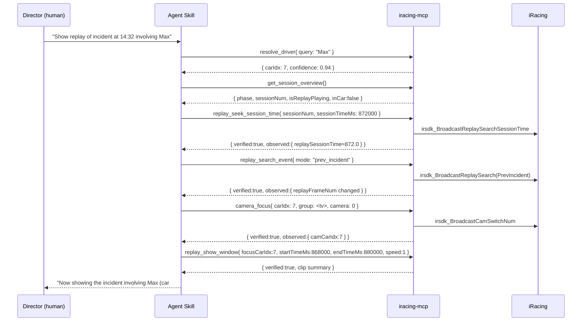

# iracing-mcp — Implementation Plan

## 1. Overview

`iracing-mcp` is an MCP server that lets an LLM agent **interrogate** and **direct** a live iRacing
session. It is the control plane behind a "sim racecenter" broadcast agent: the agent understands
natural-language director commands, and this server provides the deterministic, verifiable tools
that actually read state and drive the simulator.

The server has two responsibilities:

1. **Expose state** from iRacing telemetry and the session YAML string as structured, typed tools.
2. **Send control commands** (replay + camera) and **verify** they took effect by reading telemetry
  back before responding.

### 1.1 Design principles

- **Deterministic tools, smart agent.** MCP tools never parse natural language. Intent parsing,
  slot filling, and orchestration live in Agent Skills. Tools take typed inputs and produce typed
  outputs.
- **Close the loop.** The iRacing control channel is fire-and-forget (see §3.2). Every mutating tool
  returns a verification block derived from telemetry.
- **Idempotent and observable.** Reads are cache-friendly and timestamped. Writes describe both the
  command sent and the observed result.
- **Fail loud, structured.** Errors are typed (`not_connected`, `wrong_mode`, `target_not_found`,
  `not_verified`, `timeout`) so the agent can choose a fallback.

## 2. The MCP server

### 2.1 Runtime & platform

- **Language:** Rust (the dev container targets `x86_64-pc-windows-gnu`; see
  [.devcontainer/devcontainer.json](../.devcontainer/devcontainer.json)).
- **Host requirement:** Must run on the **same Windows host** as iRacing. The SDK uses a local
  shared-memory map (`Local\IRSDKMemMapFileName`) and a registered broadcast window message
  (`IRSDK_BROADCASTMSG`); both are local-only. See
  [irsdk_defines.h](../iracing/irsdk-1-20/irsdk_1_20/irsdk_defines.h#L85).
- **Transport:** MCP over **stdio** by default (best for local agent runners), with an optional
  **streamable HTTP** transport for remote agent hosts on the LAN.

### 2.2 Internal layers

```
┌──────────────────────────────────────────────┐
│ MCP layer (tool registry, JSON schema, I/O)   │
├──────────────────────────────────────────────┤
│ Domain layer (Session, Roster, Replay, Camera)│  ← verification logic lives here
├──────────────────────────────────────────────┤
│ SDK adapter (telemetry read + broadcast send) │  ← FFI / shared-memory + Win32 message
├──────────────────────────────────────────────┤
│ iRacing SDK (shared memory + broadcast msg)   │
└──────────────────────────────────────────────┘
```

- **SDK adapter** wraps the two halves of the SDK:
  - **Telemetry read** mirrors the cached-client pattern from
    [irsdk_client.h](../iracing/irsdk-1-20/irsdk_1_20/irsdk_client.h#L33) (`irsdkClient` — connect,
    `waitForData`, `getVarInt/Float/Double/Bool`, session-string access).
  - **Command send** mirrors [irsdk_broadcastMsg](../iracing/irsdk-1-20/irsdk_1_20/irsdk_utils.cpp#L365).
- **Domain layer** turns raw vars and YAML into normalized structures and runs verification polls.
- **MCP layer** registers tools, validates inputs against JSON Schema, and serializes results.

### 2.3 Telemetry vs. session string

iRacing exposes two data shapes (both documented in
[telemetry_11_23_15.md](../iracing/telemetry_11_23_15.md)):

1. **Live telemetry variables** — updated 60×/sec, used for fast state and **command verification**
   (e.g. `ReplayFrameNum`, `ReplayPlaySpeed`, `CamCarIdx`).
2. **Session string (YAML)** — semi-static, updated occasionally; the source for roster, weekend
   info, camera groups, and standings. Parsed via the session-string accessor pattern in
   [irsdk_client.h](../iracing/irsdk-1-20/irsdk_1_20/irsdk_client.h#L75).

The server caches the session string and only re-parses when its update counter changes
(`getSessionInfoStrUpdate()` / `wasSessionStrUpdated()`), matching the SDK's guidance that the
linear YAML parser is slow.

## 3. The iRacing control surface (SDK references)

### 3.1 Commands available

All remote control flows through one enum,
[`irsdk_BroadcastMsg`](../iracing/irsdk-1-20/irsdk_1_20/irsdk_defines.h#L455). The subset this
project uses:

| Broadcast message | Params (`var1, var2, var3`) | Purpose |
| --- | --- | --- |
| `irsdk_BroadcastCamSwitchPos` | position, group, camera | Focus camera by **running position** |
| `irsdk_BroadcastCamSwitchNum` | car number, group, camera | Focus camera by **car number** |
| `irsdk_BroadcastCamSetState` | `irsdk_CameraState`, –, – | Toggle camera tool / UI state |
| `irsdk_BroadcastReplaySetPlaySpeed` | speed, slowMotion, – | Play / pause / FF / rewind |
| `irsdk_BroadcastReplaySetPlayPosition` | `irsdk_RpyPosMode`, frame | Seek to a frame |
| `irsdk_BroadcastReplaySearch` | `irsdk_RpySrchMode`, –, – | Jump to lap/incident/session/frame |
| `irsdk_BroadcastReplaySetState` | `irsdk_RpyStateMode`, –, – | Erase replay tape |
| `irsdk_BroadcastReplaySearchSessionTime` | sessionNum, sessionTimeMS | Seek to a session time |

Supporting enums:

- Play position modes — [`irsdk_RpyPosMode`](../iracing/irsdk-1-20/irsdk_1_20/irsdk_defines.h#L534)
  (`Begin`, `Current`, `End`).
- Search modes — [`irsdk_RpySrchMode`](../iracing/irsdk-1-20/irsdk_1_20/irsdk_defines.h#L519)
  (`ToStart`, `ToEnd`, `PrevSession`, `NextSession`, `PrevLap`, `NextLap`, `PrevFrame`, `NextFrame`,
  `PrevIncident`, `NextIncident`).
- Replay tape state — [`irsdk_RpyStateMode`](../iracing/irsdk-1-20/irsdk_1_20/irsdk_defines.h#L506)
  (`EraseTape`).
- Camera focus shortcuts — [`irsdk_csMode`](../iracing/irsdk-1-20/irsdk_1_20/irsdk_defines.h#L549)
  (`FocusAtIncident = -3`, `FocusAtLeader = -2`, `FocusAtExiting = -1`, `FocusAtDriver = 0`).

A working keyboard-driven example of every one of these calls is in the SDK sample
[msgtest.cpp](../iracing/irsdk-1-20/irsdk_1_20/irsdk_msgtest/msgtest.cpp#L126).

### 3.2 Transport reality: fire-and-forget

The broadcast helper resolves the registered message id once and posts it system-wide:

```cpp
// irsdk_utils.cpp
static unsigned int msgId = RegisterWindowMessage(IRSDK_BROADCASTMSGNAME);
...
SendNotifyMessage(HWND_BROADCAST, msgId, MAKELONG(msg, var1), var2);
```

See [irsdk_utils.cpp](../iracing/irsdk-1-20/irsdk_1_20/irsdk_utils.cpp#L347). `SendNotifyMessage`
**returns immediately and gives no application-level acknowledgement**. This is the core reason the
server must verify via telemetry (§4).

### 3.3 Hard constraint: out of car

> "camera and replay commands only work when you are out of your car" —
> [irsdk_defines.h](../iracing/irsdk-1-20/irsdk_1_20/irsdk_defines.h#L453)

The server therefore **pre-checks eligibility** before sending replay/camera commands using
`IsOnTrack` / `IsInGarage` (see [telemetry_11_23_15.md](../iracing/telemetry_11_23_15.md#L47)) and
returns a `wrong_mode` error if the player is in the car, instead of silently failing.

### 3.4 Parameter encoding notes

- `var2`+`var3` are packed into a 32-bit value via `MAKELONG`; for frame numbers and session times
  the high/low split matters (see the `replayFrame` usage in
  [msgtest.cpp](../iracing/irsdk-1-20/irsdk_1_20/irsdk_msgtest/msgtest.cpp#L165)).
- Float params (e.g. FFB max force) are encoded as fixed-point by multiplying by 2^16; not used by
  the replay/camera tools but documented for completeness in
  [irsdk_utils.cpp](../iracing/irsdk-1-20/irsdk_1_20/irsdk_utils.cpp#L357).
- Car numbers may need zero-padding (`#001`); the SDK provides
  [`irsdk_padCarNum`](../iracing/irsdk-1-20/irsdk_1_20/irsdk_defines.h#L617).

## 4. Feedback verification model

Because commands are fire-and-forget, every mutating tool follows the same loop:

1. **Pre-check** connection + eligibility (out-of-car for replay/camera).
2. **Snapshot** the relevant telemetry vars (the "before" state).
3. **Send** the broadcast message.
4. **Poll** telemetry for up to `timeoutMs`, waiting for the expected post-condition.
5. **Return** a structured response with `verified: true|false`, the observed state, and a reason.

The verification variables per command are enumerated in
[FEEDBACK_VERIFICATION.md](FEEDBACK_VERIFICATION.md). Key telemetry signals:

- Playback — `IsReplayPlaying`, `ReplayPlaySpeed`, `ReplayPlaySlowMotion`
  ([telemetry_11_23_15.md](../iracing/telemetry_11_23_15.md#L50)).
- Position — `ReplayFrameNum`, `ReplayFrameNumEnd`, `ReplaySessionNum`, `ReplaySessionTime`
  ([telemetry_11_23_15.md](../iracing/telemetry_11_23_15.md#L110)).
- Camera — `CamCarIdx`, `CamGroupNumber`, `CamCameraNumber`, `CamCameraState`
  ([telemetry_11_23_15.md](../iracing/telemetry_11_23_15.md#L19)).

## 5. Tool surface (summary)

Full schemas live in [TOOL_REFERENCE.md](TOOL_REFERENCE.md). Grouped by purpose:

**Session interrogation (read-only)**
- `get_session_overview`
- `get_weekend_info`
- `get_roster`
- `get_camera_groups`
- `get_standings`
- `get_relatives`
- `resolve_driver`

**Replay control (mutating + verified)**
- `replay_get_state`
- `replay_set_playback`
- `replay_seek_frame`
- `replay_seek_session_time`
- `replay_search_event`
- `replay_show_window` (composite convenience)

**Camera control (mutating + verified)**
- `camera_focus`
- `camera_set_state`

## 6. Example use case (end-to-end)

**Director command:** "Show the replay of the incident at 14:32 involving Max."

The Agent Skill parses the command into slots and calls MCP tools in sequence:



Notes:
- `resolve_driver` maps the spoken name to a stable `carIdx` from the roster (the YAML `Drivers`
  array — see [telemetry_11_23_15.md](../iracing/telemetry_11_23_15.md#L606)).
- The agent confirms `inCar: false` from `get_session_overview` before issuing camera/replay
  commands, satisfying the §3.3 constraint.
- Each mutating call returns `verified`, so the Skill can retry (e.g. nudge with `replay_seek_frame`)
  or report honestly if a step failed.

## 7. Milestones

| Milestone | Scope | Exit criteria |
| --- | --- | --- |
| M0 — SDK adapter | Connect, read telemetry vars, read session YAML, send one broadcast | `replay_get_state` returns live values; a manual play command moves `ReplayFrameNum` |
| M1 — Read tools | `get_session_overview`, `get_weekend_info`, `get_roster`, `get_camera_groups`, `get_standings`, `get_relatives`, `resolve_driver` | Tools return normalized structures from a live/replay session |
| M2 — Replay control | `replay_set_playback`, `replay_seek_frame`, `replay_seek_session_time`, `replay_search_event` with verification | Each tool returns `verified:true` against a live session |
| M3 — Camera control | `camera_focus`, `camera_set_state` with verification | Camera vars confirm changes |
| M4 — Composite + polish | `replay_show_window`, error taxonomy, eligibility pre-checks, caching | Example use case (§6) runs end-to-end |
| M5 — Integration tests | Automated agent-driven tests against live iRacing | See [TESTING.md](TESTING.md) |

### 7.1 Status audit (2026-06-16)

- [x] M0 complete.
  Evidence: live `replay_get_state` and replay control work through the SDK adapter and broadcast path.
- [ ] M1 in progress.
  Evidence: existing read tools are exposed and passing transport tests, and `get_relatives` is now implemented as a live track-order and gap view computed from telemetry arrays rather than a centered anchor-based panel.
- [x] M2 complete.
  Evidence: `replay_set_playback`, `replay_seek_frame`, `replay_seek_session_time`, and `replay_search_event` all verify and pass live tests.
- [x] M3 complete.
  Evidence: `camera_focus` and `camera_set_state` are implemented with telemetry verification and pass live tests.
- [x] M4 complete.
  Evidence: `replay_show_window` is implemented with step-level verification, replay/camera eligibility pre-checks are enforced, verification timeout responses now return explicit MCP error codes (`timeout`), and session YAML reads are cached by `session_info_update`.
- [x] M5 complete.
  Evidence: `cargo test --test live_mcp_suite -- --ignored --nocapture` passed with the stable live suite (4/4).

## 8. Risks & mitigations

- **Out-of-car constraint** → eligibility pre-check + `wrong_mode` error (§3.3).
- **Fire-and-forget commands** → telemetry verification loop (§4).
- **Slow YAML parser** → cache by session update counter (§2.3).
- **Frame-vs-time addressing** → prefer `replay_seek_session_time`; treat frames as 60/sec
  (per `ReplayFrameNum` description in [telemetry_11_23_15.md](../iracing/telemetry_11_23_15.md#L110)).
- **Relatives math** → compute from live `CarIdx*` arrays and return the full field; do not
  require an anchor car or center-window assumption.
- **Same-host requirement** → documented in the user guide; optional LAN HTTP transport for the
  agent host, but the server binary stays on the sim PC.
